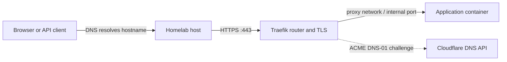

# Infrastructure

The shared entrypoints and platform services behind the applications. Traefik
is the central component: it receives web traffic for the homelab, handles TLS,
and routes each hostname to the correct container.

| Project | Purpose | Access and integration |
| --- | --- | --- |
| [Traefik](traefik/) | Reverse proxy, HTTPS certificate management, and Docker-label routing | Host ports 80/443; `proxy` network; dashboard at `traefik.${TRAEFIK_ACME_DOMAIN}` |
| [Forgejo](forgejo/) | Self-hosted Git repositories, code review, and collaboration | Web at `git.${TRAEFIK_ACME_DOMAIN}`; SSH host port 222; PostgreSQL on `database` |
| [Infisical](infisical/) | Application for managing and distributing secrets | Web at `infisical.${TRAEFIK_ACME_DOMAIN}`; database URI and Valkey configured separately |

## Traefik routing and certificates

The request path is:



DNS records must direct application hostnames to the host or its configured
ingress. `TRAEFIK_ACME_DOMAIN` supplies the suffix used in router labels;
Traefik matches those names but does not provision DNS records for applications.

The Docker provider watches the rootless daemon through the mounted
`DOCKER_SOCK`. `exposedbydefault=false` makes routing opt-in:
`traefik.enable=true` is required. Traefik's default Docker network is `proxy`.
For containers on multiple networks, `traefik.docker.network=proxy` makes the
intended backend path explicit.

The `web` entrypoint listens on port 80, and `websecure` on 443. The configuration
defines an HTTP catch-all redirect router and per-service HTTPS routers.
An HTTPS router names the `cloudflare` certificate resolver, which uses an ACME
DNS-01 challenge. The Cloudflare API token is read from the `cloudflare_dns`
secret; ACME email and server are host-wide env settings. Certificate state
persists in `${DATA_DIR}/acme.json`, which must be writable by the mapped
container user and have the restrictive permissions Traefik requires (`0600`).

DNS-01 validates domain ownership through DNS rather than an application's HTTP
endpoint. Successful certificate issuance alone does not prove that client DNS,
ingress, the backend network, or the application health is correct.

## Adding a web route

Join the application to the external `proxy` network and add labels in the
repository's list format. This example routes an app listening on port 8080:

```yaml
services:
  app:
    networks:
      - proxy
    labels:
      - "traefik.enable=true"
      - "traefik.docker.network=proxy"
      - "traefik.http.routers.app.rule=Host(`app.${TRAEFIK_ACME_DOMAIN}`)"
      - "traefik.http.routers.app.entrypoints=websecure"
      - "traefik.http.routers.app.tls.certresolver=cloudflare"
      - "traefik.http.services.app.loadbalancer.server.port=8080"

networks:
  proxy:
    external: true
```

The application listens on its container interface, normally `0.0.0.0`, so
Traefik can reach it. A host `ports:` mapping is unnecessary for this web route.
SSH, discovery protocols, and deliberately exposed APIs are separate cases.
Add `homepage.*` labels when the application should appear on the dashboard.

## Dashboard, readiness, and troubleshooting

The Traefik dashboard router uses `api@internal` and the `traefik-auth`
Basic Auth middleware, backed by the `htpasswd` secret. That middleware protects
the dashboard route; other routers must declare their own authentication or
use their application's login. TLS does not add application authorization.

The internal port 8080 serves the API/dashboard and `/ping` used by the
healthcheck; it is not published directly on the host. Homepage reaches the
internal API over Docker networking. Traefik joins `metrics`, but Prometheus
metrics are currently disabled in the Compose command flags.

For a failing route, check DNS and host reachability first, then Traefik's
router/certificate logs, the service's labels and `proxy` membership, its
internal listening port, and application health. Keep ACME state when
recreating the container so certificate history is retained.

Traefik must be running for domain-based access. Container-to-container APIs and
databases can still operate without Traefik when they use their own networks.

## Forgejo and Infisical

Forgejo requires `db-vchord` in the dependency mirror. Its web traffic uses
Traefik, while Git-over-SSH uses host port 222 mapped to container port 2222.
The image refuses to run the application as container root, so the secret
entrypoint reads credentials before explicitly dropping to its `git` user.
Its persistent data needs that user's mapped ownership.

Infisical is a separate secret-management application. Its existence does not
replace the repository's file-backed `SECRET_DIR` convention automatically.
The current Compose file reads its database URI, authentication secret, and
encryption key from files under its own `DATA_DIR`; its runtime env references
Valkey. It also publishes host port 8080 in addition to the Traefik route.
These service relationships are not currently listed in `service.toml`.

[Repository guide](../README.md) · [Database services](../db/README.md) · [Dependency mirror](../service.toml)
